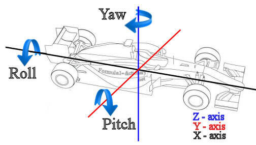
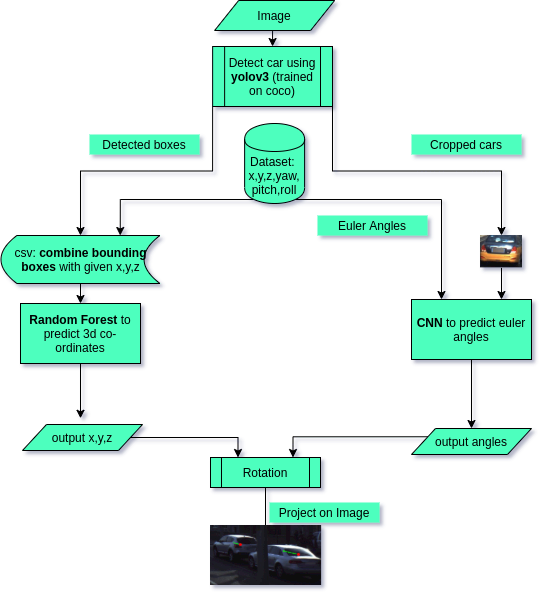
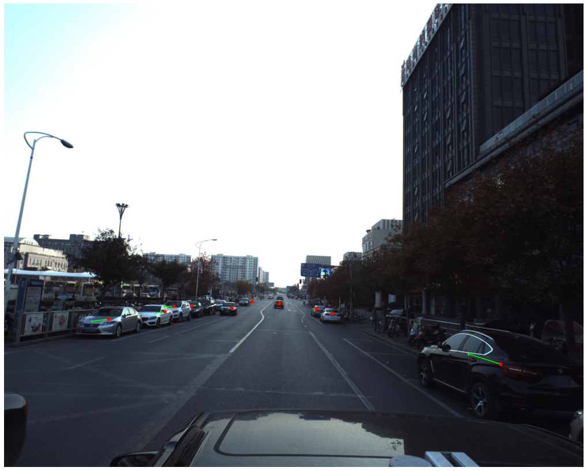

# Vision based absolute Pose estimation of Autonomous Vehicle

Accurate localization for any autonomous vehicle (AV), especially in indoor and GPS-denied (Global Positioning System) environment. To close the gap, vision-based pose estimation in real time is a promising solution. The aim of this work is to provide a solution to estimate the pose of vehicles (6 degrees of freedom) from a single image in a real-world traffic environment. This 6 DoF includes 3D world coordinates (x,y,z), yaw, pitch, and roll of the detected car as follows:
<p align="center">
  
</p>

## Solution

A two-staged 6DoF object detection pipeline is proposed in this work. Firstly, YOLO object detector is applied to provide object bounding boxes. Then two regressor is applied to estimate the 3d properties and euler angles.
Below is the architecture description for the same.


<p align="center">
  
</p>


- Car detection: Identify cars on each image with YOLOV3 and obtain the bouding boxes.
- 3d coordinates(x’,y’,z’): Train a model to regress with the bounding boxes as features and (x,y,z) as labels.
- Yaw/Pitch/Roll - 
  - Assumptions: Roll and pitch ~ 0 (can be checked from distributions).
  - yaw  (θg) = local angle (θl) + rayangle (θray) (calculated using camera matrix K)
  - Regress θl in two steps
    - Classification:  8 spaced bins. Which bin?
    - Regression: Angle
  - Rotate predicted x,y,z by predicted angle.
  - Project result on 2D (image) using K.


## Install dependencies
```
pip install -r requirements.txt
```

## Dataset
The dataset can be accesible from the Kaggle Challenge - https://www.kaggle.com/c/pku-autonomous-driving/data 

## Usage
- Download yolov3 model for car detection and save path(trained_models).
- Train Yaw Prediction Model from script car-yaw-prediction.ipynb and save the model in trained_models folder.
- Use pos_predictor.joblib (can be downloaded from https://www.kaggle.com/alvaroibrain/car-position-estimation-full-pipeline/output?select=pos_predictor.joblib) to predict the 3D co-ordinates. 
- Run Car Position Estimation - Full pipeline.ipynb providing proper path.

## Test Result
The estimated pose of the detected cars are as follows:

<p align="center">
  
</p>

## Reference
- Peking University/Baidu - Autonomous Driving. Can you predict vehicle angle in different settings? - https://www.kaggle.com/c/pku-autonomous-driving
- 3D Bounding Box Estimation Using Deep Learning and Geometry, Mousavian et al.
- https://www.kaggle.com/alvaroibrain/car-position-estimation-full-pipeline/output

